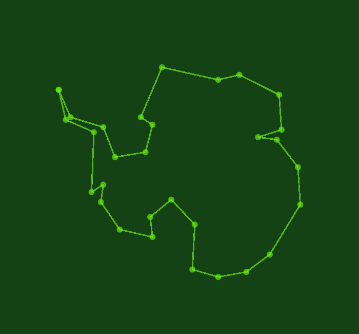

# Data visualisation

This repository includes the code to generate a probabilistic represenation of Antarctica's outline, generated by a GP, as a logo to represent **probabilistic machine learning for the Antarctic science**

This is the static image we generate:  
  
  

And this is the gif we generate:

